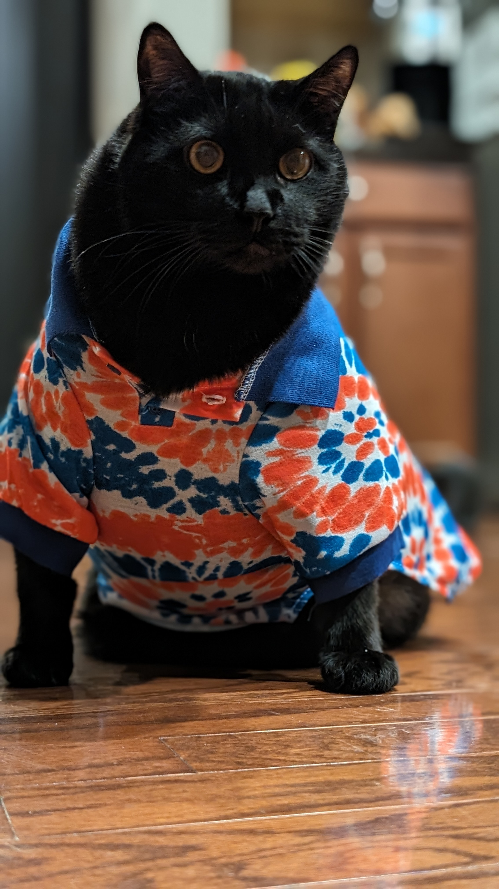

# 517MorrisBlackcats
 Highlighting black cats

# Black Cats: a history
Black cats are associated with Halloween and bad luck. [Learn more](https://www.history.com/news/black-cats-superstitions).

Are black cats bad luck? Not always! [Learn more about black cats and supersitions](https://carnegiemnh.org/superstitions-and-black-cats/).

Black cats are facinating. [Here are 13 facinating facts on black cats.](https://www.thesprucepets.com/facts-about-black-cats-554102).

## Lexus the black cat

- 12 years old
* 27 pounds of love
* Loves to nap

# Food
1. Important
2. Knows the timing for his feeding at 6:30 am and 6:30 pm
3. Will not eat wet food but loves Greenies treats
